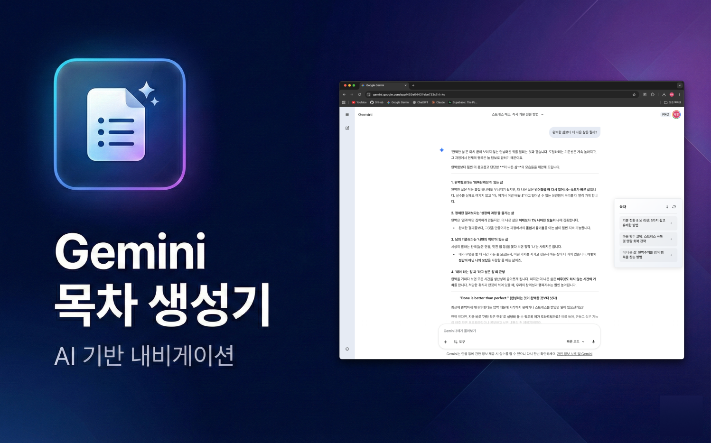
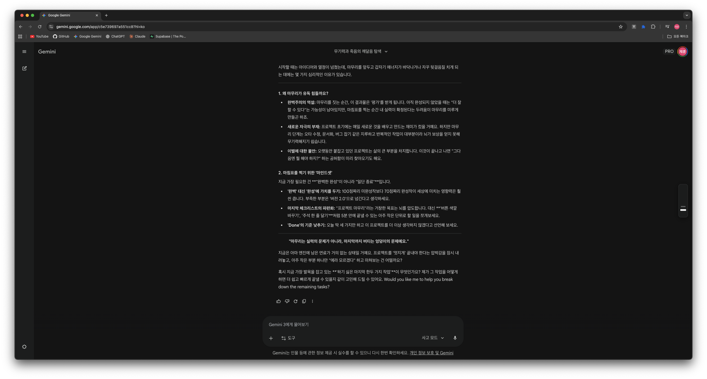
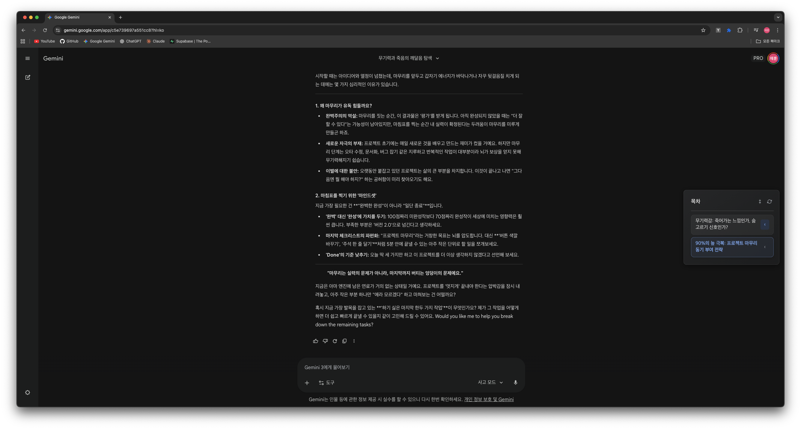

# Gemini ToC Maker

[Reference to Korean Version (한국어 버전)](./README_KR.md)

**Gemini ToC Maker** is a Chrome extension that automatically generates a Table
of Contents (ToC) for your Google Gemini chats. It uses AI to summarize long
conversations, organizing them into a clear, navigable structure so you can
easily find and jump to specific topics.

 

## ✨ Features

- **Auto-Generated ToC**: Automatically creates a table of contents based on
  your chat history.
- **Easy Navigation**: Click on any item in the ToC to instantly scroll to that
  part of the conversation.
- **Theme Support**: Seamlessly adapts to both Light and Dark modes of the
  Gemini interface.
- **Customizable**: Configure your own Gemini API Key for personalized summary
  generation.

## 🚀 Installation

You can install the extension directly from the Chrome Web Store:

[**👉 Download from Chrome Web Store**](https://chrome.google.com/webstore/detail/placeholder)

_(Link will be updated once the extension is published)_

## ⚙️ Usage

1. **Set Up API Key**:
   - Click the extension icon in your browser toolbar.
   - Enter your Google Gemini API Key in the settings popup.
   - Click "Save Settings".
2. **Open Gemini**:
   - Go to [gemini.google.com](https://gemini.google.com).
   - Open any chat.
   - Click the **"Generate ToC"** button in the sidebar to create the Table of
     Contents.

## 🛠️ Tech Stack

- **JavaScript (ES6+)**
- **HTML5 & CSS3**
- **Chrome Extension Manifest V3**

---

_Note: This extension is an independent project and is not affiliated with
Google._
